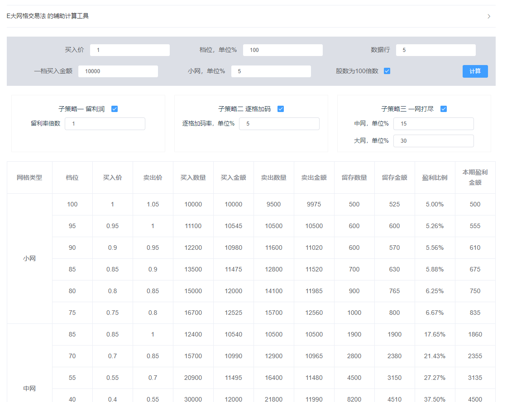

## 介绍

本工具是基于E大网格交易的策略，所制作的辅助计算程序，可根据自己的价格、资金生成表格供参考

策略具体是指以下两篇文章，使用前请仔细研读E大的思路:

[波段策略.网格之二：网格策略基础/1.0版](https://mp.weixin.qq.com/s/-czfqGvxkDcay_tSI1jv5g)

[波段策略.网格之三：网格策略进阶/2.0版](https://mp.weixin.qq.com/s/8pRKsjiQSZzrmH-uWCkRLQ)

## 使用
不关心代码的同学只需下载dist\index.html文件，在浏览器即可打开

## 以下为工具的参数解释：

买入价: 为设置档位的买入价格，需根据基金的价格和档位自行判断设置

档位: 买入价格对应的档位，这里初始档位为100，若设置其他的数值，会向上计算到100。

数据行: 当档位为100时可以设置向下计算的数据行数，当档位非100时不会向下计算，此项无意义隐藏

一档买入金额: 100档位买入的总资金，也是每次交易的资金，会根据子策略2变化

股数为100倍数： 实际交易中，一般交易份额为100的倍数，默认开启

其他参数则基本和文章里的概念一致

## 页面使用参考：

实际情况可能是这样：我们先确定交易品种，然后根据其历史价格确定第一档位，或者确定当前是哪个档位

那么基本只要修改买入价、档位、一档买入金额这三项数据，然后点击计算生成表格

若有错误，请予指正
